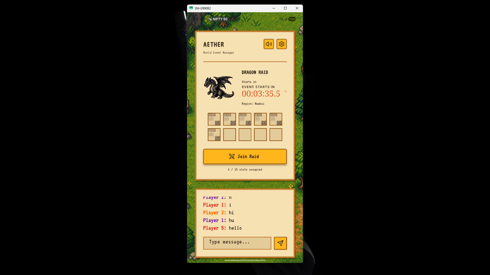
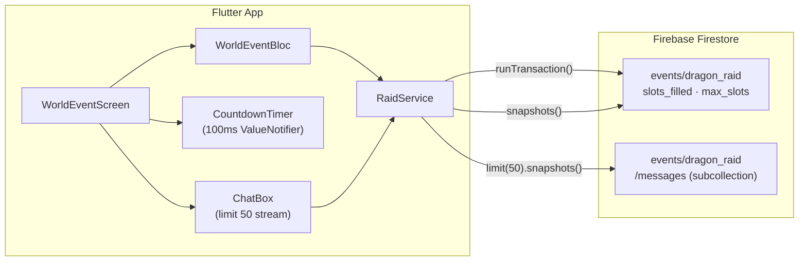
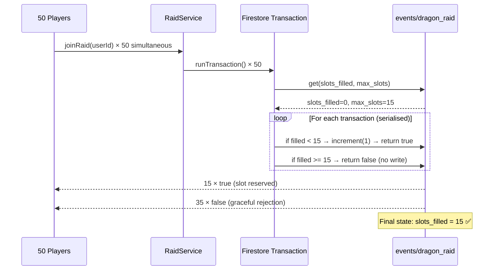
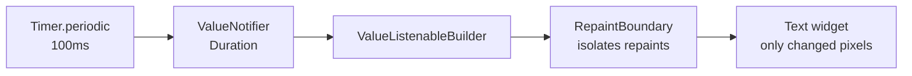
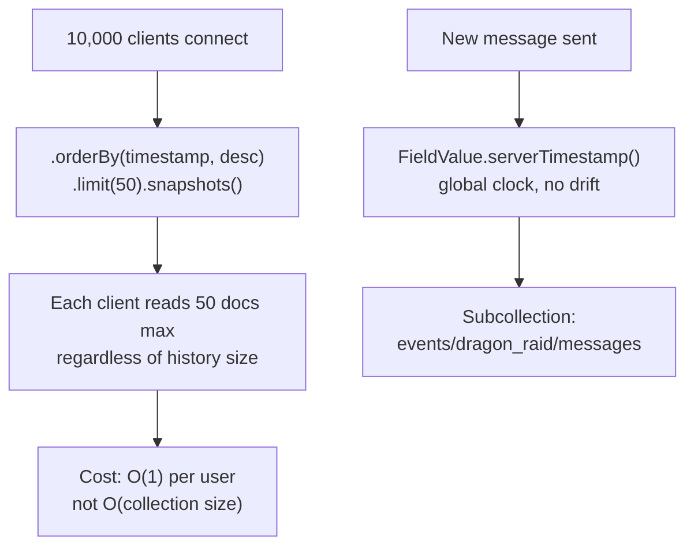

<div align="center">

# 🐉 Project Aether

### World Event Manager — High-Concurrency MMORPG Nervous System

*Flutter · Firebase Firestore · BLoC · Atomic Transactions*


</div>

---

## 📸 Preview

<div align="center">



> Single-screen Flutter app running live on Android. Pixel-art RPG aesthetic with real Firebase backend.

</div>

---

## ⚙️ Setup

```bash
# 1. Clone and install
git clone <your-repo-url>
cd aether_project
flutter pub get

# 2. Configure Firebase secrets
cp .env.example .env
# Fill in your Firebase credentials in .env

# 3. Run
flutter run

# 4. Verify architecture (generates ARCHITECTURE_REPORT.md)
dart aether_linter.dart
```

> **Note:** The `.env` file is gitignored. Without it the app crashes on launch. Use `.env.example` as your template — all required keys are listed there.

---

## 💰 Firebase Cost Strategy (10,000 Concurrent Users)

Chat messages are stored in a subcollection under each event document, and every client listener is capped at `.limit(50)` — meaning each of the 10,000 clients reads at most 50 documents regardless of total message history, keeping reads at a flat O(1) per user rather than O(collection size). All messages use `FieldValue.serverTimestamp()` so ordering is globally consistent without extra reads or client-clock drift. Older message history is loaded only on explicit user scroll (pagination on demand), so baseline read cost stays constant even as the chat grows to millions of messages.

---

## 🏗️ System Architecture



---

## ⚔️ Concurrency Flow — Thundering Herd



---

## 🚀 Architectural Highlights

### 1. Thundering Herd Protection

50 players hit **Join** at the exact same millisecond. Exactly 15 get in. The 16th fails gracefully.

The `RaidService` uses a Firestore **atomic transaction** — a read-check-write that is serialised at the database level. No client-side counter, no optimistic update, no race condition possible.

```dart
// @AETHER: runTransaction guarantees atomic read-check-write.
// A plain get()+update() loses the race at high concurrency.
return _firestore.runTransaction<bool>((transaction) async {
  final snapshot = await transaction.get(docRef);
  final filled = (snapshot.data()?['slots_filled'] as int?) ?? 0;
  final max    = (snapshot.data()?['max_slots']    as int?) ?? 15;

  if (filled >= max) return false; // graceful rejection

  // @AETHER: FieldValue.increment is atomic server-side.
  transaction.update(docRef, {'slots_filled': FieldValue.increment(1)});
  return true;
});
```

**Verified by:** `test/raid_concurrency_test.dart` — fires 50 concurrent `Future.wait` requests and asserts exactly `successfulJoins == 15` and `slotsFilled == 15`.

---

### 2. Global Pulse Timer — 100ms Precision, Zero Drift

The countdown timer updates 10 times per second without drifting and without rebuilding the widget tree.



- `ValueNotifier` — only the timer text rebuilds, not the whole screen
- `RepaintBoundary` — GPU compositing layer isolates the 100ms repaints
- Drift correction — calculated against `DateTime.now()` each tick, not accumulated

---

### 3. Real-Time Chat — Cost-Safe at Scale



- Subcollection per event — chat is isolated, not polluting the main document
- `.limit(50)` — hard cap on every listener, flat read cost at any scale
- `serverTimestamp()` — consistent ordering across players in Mumbai, London, and Tokyo

---

### 4. Premium RPG Design System

- **Pixel-art aesthetic** — custom sprite sheet with 56 character avatars assigned to raid slots
- **Retro VT323 font** — matches the MMORPG world theme
- **Responsive layout** — custom `MediaScreen` utility handles Phone, Tablet, and Landscape
- **Adaptive theming** — light/dark mode with smart icon contrast

---

## 🛠️ Tech Stack

| Layer | Technology | Why |
|---|---|---|
| UI Framework | Flutter 3.x | Cross-platform, 60fps, `RepaintBoundary` control |
| State Management | BLoC (`flutter_bloc`) | Predictable, testable, stream-based |
| Database | Cloud Firestore | Real-time streams + server-side transactions |
| Env Config | `flutter_dotenv` | Secrets out of source control |
| Testing | `fake_cloud_firestore` | In-memory Firestore mock, zero Firebase billing |
| Linting | `flutter_lints` + strict `analysis_options` | Zero warnings enforced |

---

## 📁 Project Structure

```
aether_project/
├── lib/
│   ├── core/
│   │   ├── constants/
│   │   ├── theme/
│   │   │   ├── app_colors.dart
│   │   │   ├── app_spacing.dart
│   │   │   ├── app_theme.dart
│   │   │   └── app_typography.dart
│   │   └── utils/
│   │       ├── bouncing_button.dart
│   │       └── media_screen.dart
│   ├── features/
│   │   └── world_event/
│   │       ├── bloc/
│   │       │   ├── world_event_bloc.dart
│   │       │   ├── world_event_event.dart
│   │       │   └── world_event_state.dart
│   │       ├── data/
│   │       └── presentation/
│   │           ├── pages/
│   │           │   └── world_event_screen.dart
│   │           └── widgets/
│   │               ├── chat_box.dart
│   │               ├── countdown_timer.dart
│   │               └── raid_button.dart
│   ├── firebase_options.dart
│   ├── main.dart
│   └── raid_service.dart          # ← injected Firestore, used by test
├── test/
│   └── raid_concurrency_test.dart # ← Thundering Herd: 50 in → 15 win
├── assets/
│   ├── dragon.png
│   ├── Characters.png             # ← 56-character sprite sheet
│   └── background.png
├── screenshots/
│   └── preview.png
├── aether_linter.dart             # ← run to generate ARCHITECTURE_REPORT.md
├── ARCHITECTURE_REPORT.md         # ← auto-generated, both checks ✅
├── AETHER_TELEMETRY.md            # ← auto-generated on git commit
├── analysis_options.yaml
├── .env.example
└── README.md
```

---

## 🛡️ Quality Assurance

```bash
dart aether_linter.dart
```

```
✅ Linter: PASS   →  flutter analyze: 0 warnings
✅ Tests:  PASS   →  50 concurrent requests → exactly 15 succeed
```

| Check | Tool | Result |
|---|---|---|
| Static analysis | `flutter analyze` | ✅ 0 warnings |
| Concurrency integrity | `raid_concurrency_test.dart` | ✅ 15 / 50 exact |
| Atomic ops detected | `AETHER_TELEMETRY.md` | ✅ runTransaction: 5, increment: 2 |
| Targeted repaints | `AETHER_TELEMETRY.md` | ✅ ValueNotifier + RepaintBoundary |

---

<div align="center">

*Built for the Aether World Event Challenge — a nervous system that breathes.*

</div>
